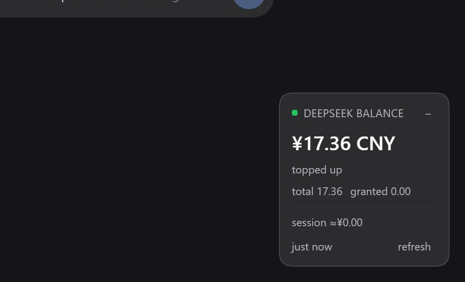

# dsh-budget-watcher

A [DeepSeek Harness](https://github.com/deepseek-ai/deepseek-harness) (`dsh`) plugin that floats a small
window over the conversation showing **how much topped-up balance is left on your API account** — and **what
the turns you just ran actually cost**.



*Captured against 0.2.0. The `topped up` caption and the `total … granted …` row it shows were removed in
0.3.0 — the headline is now the total on its own, and the split lives in the settings tab.*

The balance is `topped_up_balance` from DeepSeek's public balance API — the money you actually paid in, not
the promotional credit that expires. When the two differ, the widget shows the split so a balance of `0.00`
next to an account that still works is not a mystery.

The cost figures are computed from the token usage DeepSeek already reports on every assistant message, which
DSH already records. **They spend no tokens of their own: no model call, no extra request, no estimation
prompt.** See [What it costs you](#what-it-costs-you).

- **Collapse to a pill** — one click, or double-click the header, leaves just the amount on screen.
- **Drag it anywhere** — grab the expanded panel anywhere on it, not just its title bar. The position is
  remembered across reloads. The collapsed pill deliberately stays put, because a pill you can nudge by
  accident is a pill you cannot click.
- **Refresh on demand** — or let it poll on its own schedule.

## What it shows

| Element | Meaning |
| --- | --- |
| `¥21.61 CNY` | `total_balance` — the whole balance: topped-up money **plus** granted credit. The headline, and the only balance row. |
| Green dot | `is_available: true` — the account can make API calls. |
| Amber dot | The balance is stale, the last check failed, `is_available` is `false`, or the burn rate is over the warning threshold. |
| Red dot | Nothing could be read and no previous value is on screen. |
| `1 min ago` | When the host last got an answer. A stale number is labelled, never passed off as current. |
| `last turn ≈¥0.22` | What the turn your last message started has cost so far, even while it is still running. |
| `session ≈¥15.12 · 4 turns · 40 agents` | The whole conversation, including the subagent sessions it spawned. |
| `burn ≈¥60.48/h` | What the last 15 minutes project to per hour. Amber when over the threshold. |
| `2 turn(s) unpriced` | A model with no published rate was seen, so those turns are reported rather than costed at a guess. |
| `Not available for API calls` | `is_available: false`. |
| `No API key is configured…` | The host found no key; the message names the credential reference to set. |

The header already says *DeepSeek balance*, so the amount carries no caption and there is no second balance
line. The granted/topped-up split — and every setting — lives behind the gear button, which keeps the panel
itself to three rows.

## What it costs you

A research turn that fans out to sixty subagents is invisible from the conversation: one turn is open, no
answer has arrived, and the balance is falling. Balance alone tells you *that* you are spending; it does not
tell you *how fast*, which is the number you need to decide whether to stop.

The panel answers that with three figures, all derived from data already on disk:

- **`last turn`** — the turn your most recent message started. It updates as the turn runs, because usage is
  reported per assistant message rather than per turn.
- **`session`** — every turn in this conversation *plus every subagent session beneath it*. A fan-out bills in
  the children, so counting only the session you are looking at would report the calm, not the fire. The
  `N agents` suffix tells you how many are in flight.
- **`burn`** — spend over the last window (15 minutes by default) projected to an hourly rate. This is the
  early warning: it moves within a minute of a fan-out starting, long before the turn finishes.

`warn` turns the dot amber and tints the burn figure once the projection crosses `burnWarnUsdPerHour`. The dot
survives collapsing the panel, so a runaway is visible from the pill.

### Where the numbers come from

DeepSeek reports exact token usage on every assistant message, and DSH writes it into the session log. The
plugin reads that log and multiplies by DeepSeek's published rates:

```
cost = uncached input × cache-miss rate
     + cache-read tokens × cache-hit rate
     + output tokens × output rate
```

Two details make the difference between an estimate and a wrong number:

- **DSH's `inputTokens` is the *uncached* half.** The cache buckets are separate. Subtracting cache reads from
  `inputTokens` — the obvious-looking arithmetic — collapses the uncached half to zero on a well-cached turn
  and under-reports exactly the turns worth watching. `dsh-llm-deepseek` states the identity outright:
  `totalTokens = inputTokens + outputTokens + cacheReadTokens + cacheWriteTokens`.
- **Retried attempts are billed.** A failed attempt settles as `assistant/attempt`, which carries no `usage`
  field at all — its numbers survive only in the last `usage` chunk of its stream. Reading just `usage` would
  silently drop the cost of every retry.

Peak and off-peak rates are applied per call from the timestamp (peak is 01:00–04:00 and 06:00–10:00 UTC,
Monday to Friday). `reasoningTokens` is recorded but never priced separately: it is a subset of output tokens,
so charging for it as well would double-bill.


## Install

```sh
dsh plugin --profile <your-profile> add dsh-budget-watcher
```

For a profile installed from this repository instead of npm:

```sh
dsh plugin --profile <your-profile> add github:NeutronStar714/dsh-budget-watcher
```

Then **restart that profile**. `dsh plugin add` writes the dependency and appends the package to
`dsh.profile.bundles`; a running process does not pick up a new bundle on its own. Configuration edits to the
row are live afterwards when the profile sets `"patchReload": "live"`.

Confirm it landed:

```sh
dsh plugin --profile <your-profile> list
```

The widget appears in the bottom-right corner as soon as the profile is up. If it does not, see
[Troubleshooting](#troubleshooting).

> [!NOTE]
> The DSH **desktop application** owns its bundled profile exclusively, and the CLI refuses to modify it
> (`error: profile "desktop" is managed exclusively by the Electron application`). Install into that profile
> from the app's own **Settings → Plugins** page instead, then restart the app. The CLI path above is for
> profiles you create and run yourself, such as `dsh web`.

### Uninstall

```sh
dsh plugin --profile <your-profile> remove dsh-budget-watcher
```

## The API key

The plugin never asks for a key of its own. It reads the same **`DEEPSEEK_API_KEY`** credential reference the
shipped DeepSeek adapter uses, so a key you already configured for inference is reused. Resolution order:

1. `apiKey` from this plugin's config, when set.
2. `apiKeyEnv` (default `DEEPSEEK_API_KEY`) through `ctx.credentials` — this is what the Web **Models** page writes.
3. `DEEPSEEK_API_KEY` from the environment that launched `dsh`.

It is resolved at every refresh, so storing a key takes effect on the next poll without a restart. The key is
used for one outbound request and is never written to the page, the route response, or a log.

> [!IMPORTANT]
> This reads the **public API** balance at `https://api.deepseek.com/user/balance`, which is what an API key
> unlocks. It is **not** the same number as Settings → Account, which comes from the DeepSeek Platform web API
> through a signed-in OAuth grant. If you sign in with an account and never stored an API key, the widget
> reports that no key is configured. See [Known limitations](#known-limitations).

## Configuration

Edit your profile's `cordis.patch.yml`, keeping the comments and replacing `[]` if the file is still empty:

```yaml
- id: budget-watcher
  config:
    provider: deepseek
    apiKeyEnv: DEEPSEEK_API_KEY
    refreshIntervalMs: 60000
    currency: auto
```

A patch replaces the row's whole `config` object, so keep every override together. All fields are optional.

| Option | Default | Purpose |
| --- | --- | --- |
| `provider` | `deepseek` | Which API account to read. Only `deepseek` is implemented; see [Known limitations](#known-limitations). |
| `apiKey` | *(empty)* | An explicit key. Prefer `apiKeyEnv`: a key written here lives in your profile file. |
| `apiKeyEnv` | `DEEPSEEK_API_KEY` | Credential reference resolved through `ctx.credentials`. |
| `endpoint` | *(the provider's)* | Override the balance endpoint. Intended for testing against a stand-in server. |
| `refreshIntervalMs` | `60000` | How long one answer is reused before the next request. Minimum `15000`. |
| `requestTimeoutMs` | `10000` | Deadline for one balance request. |
| `currency` | `auto` | `auto` prefers CNY, then the first wallet returned. Or an explicit code such as `CNY` / `USD`. |
| `allowNonLoopback` | `false` | Allow the widget to read balance when the GUI is served on a non-loopback address. |
| `costEnabled` | `true` | Estimate what recent turns cost from the usage the provider already reports. Spends nothing. |
| `burnWindowMs` | `900000` | Window for the recent-spend rate, in milliseconds (minimum `60000`). This is the runaway warning. |
| `burnWarnUsdPerHour` | `2` | Projected USD per hour above which the panel flags the spend. `0` disables the warning. |
| `usdToCny` | `7.2` | Rate used to show USD API spend beside a CNY balance. An approximation, and yours to set. |
| `costCurrency` | `auto` | Currency for cost figures: `auto` follows the featured balance currency, or an explicit `CNY` / `USD`. |

To disable the plugin without uninstalling it:

```yaml
- id: budget-watcher
  disabled: true
```

## Settings

The panel's **gear button** opens a *Budget* tab in DSH's right sidebar: every option above as an editable
field, with Save. The gear only appears when a tab could actually be registered, so it is never a control that
does nothing.

Durations are shown in the units you think in — the refresh interval in **seconds**, the burn window in
**minutes** — and converted back on save. The API key field is write-only: it starts blank, blank means
*leave it alone*, and clearing it removes the key from the profile. The running key value is never sent to the
page; the form only knows whether one is set.

Saving goes through DSH's own config editor, so the change lands in your profile's `cordis.patch.yml` and is
applied by the normal loader path — the same file and the same mechanism you would edit by hand:

```yaml
- id: budget-watcher
  name: dsh-budget-watcher
  config:
    currency: USD
    burnWindowMs: 600000
    burnWarnUsdPerHour: 3.5
```

A value set back to its default is removed rather than written, so the row goes back to inheriting. Config
edits apply without restarting DSH.

If the row cannot be written — no config editor in the composition, or a home patch or `--patch` overlay that
also sets it — the tab says so and disables Save rather than failing on click.

> [!NOTE]
> This uses the plugin's own route plus the host `configEditor` service rather than DSH's generated
> `remote.settings` transport. The generated path needs a schemastery `Config` whose fields are all
> `.volatile()`, and a client-side form built on `configForms`; the route is smaller, is covered by tests, and
> was verified writing a real profile patch. Migrating to the generated transport is the natural next step if
> the plugin grows more settings.

## How it works

Two halves in one package, which is what `dsh.bundle.patch` plus `dsh.client` describe.

**Host half** (`index.js`) does everything that needs a secret or a socket. It resolves the key, calls
`GET https://api.deepseek.com/user/balance` with `Authorization: Bearer <key>`, normalizes the response, and
serves it to the page as JSON over one route: `GET /dsh-budget-watcher/balance`.

- **Caching with single flight.** One answer is reused for `refreshIntervalMs`, and concurrent requests share
  one in-flight upstream call, so ten open windows do not mean ten requests.
- **A failure keeps the last number.** The previous balance stays on screen marked stale rather than blanking.
  An unreadable body is a protocol error, never a rendered `0.00`.
- **`?refresh=1`** bypasses the freshness window; that is what the refresh button does.
- **A same-origin fence.** The route lives outside `/api`, so it applies its own checks: the `Host` header must
  name a loopback authority (which is what stops a DNS-rebinding page), a present `Origin` must match `Host`,
  and `sec-fetch-site: cross-site` is refused. Only `GET` is served.

**Client half** (`lib/client.cjs`) is a hand-written classic script in the loader's lazy-CJS format — no
bundler, no JSX, no runtime dependencies. It registers into the frame-wide `shell.overlay` slot, the seat
described by DSH as "above every column and outside their scroll containers", and draws with `React.createElement`
and the `--dsw-*` theme tokens so it follows the active light or dark theme. Its stylesheet carries
`data-plugin` / `data-plugin-css`, which is how the shell reclaims plugin CSS on unload.

**Which conversation to price** comes from the client, not from a guess. A root-scoped slot entry receives the
frame's standard kit as props, so the panel reads the retained session the same way DSH's own title bar does —
`useSessions`, selecting the row with `retainedBy.mainView > 0` — and sends it as `?session=`. The host falls
back to the newest live root session when the parameter is absent, so an older client still gets an answer
rather than nothing.

The package declares **no `@deepseek-ai/dsh*` peer dependencies and imports none**, so the compatibility gate
cannot refuse it and there is nothing for pnpm to install. The one optional import, `@deepseek-ai/schemastery`
for config validation, is dynamic and degrades to unvalidated config rather than failing the profile.

### Files

| Path | What it is |
| --- | --- |
| `index.js` | Host half: config, credential resolution, the upstream request, caching, the `/dsh-budget-watcher/balance` route and its fence, and the cost payload. |
| `lib/balance.js` | Pure helpers: normalizing the payload, choosing a currency, mapping HTTP failures to messages. No DSH or `fetch` imports, so it is directly testable. |
| `lib/cost.js` | Pure cost model: DeepSeek's rate card, peak/off-peak selection, usage→USD, and the fold from session events to per-turn totals. |
| `lib/ledger.js` | Which sessions count as one conversation's spend: the live tree, descendants, and a total that does not fall when a subagent finishes. |
| `lib/client.cjs` | Client half: the floating window, drag/collapse state, session handshake, polling, and the panel stylesheet. |
| `cordis.patch.yml` | The bundle patch inserting the loader row. |
| `test/` | `node --test` suite: `balance`, `cost`, `ledger`, `host` (the route against a stubbed API) and `client` (the bundle in a VM with a stubbed loader). |
| `docs/screenshot.png` | The widget running in a real browser. |

## Development

No build step and no dependencies — `node --test` is the whole toolchain.

```sh
node --test
```

To try a local checkout against a real profile without publishing:

```sh
dsh plugin --profile <your-profile> add link:/absolute/path/to/dsh-budget-watcher
```

Then restart the profile. Because the dependency is a symlink, edits to `index.js` are picked up by a profile
restart, and edits to `lib/client.cjs` are served on the next request.

## Troubleshooting

| Symptom | Cause and fix |
| --- | --- |
| No widget at all | The profile was not restarted after `dsh plugin add`, or the row is `disabled`. Check `dsh plugin --profile <name> list`. |
| `No API key is configured` | Store a DeepSeek API key on the **Models** page, or export `DEEPSEEK_API_KEY` before launching `dsh`. |
| `DeepSeek rejected the API key` | The key is wrong, revoked, or belongs to a different account. |
| `Could not reach api.deepseek.com` | Offline, or a proxy that DSH's global dispatcher does not know about. See [Known limitations](#known-limitations). |
| `forbidden: host is not a loopback authority` | You reached the GUI through a LAN name or a non-loopback reverse proxy. Set `allowNonLoopback: true` only if you accept that the route is then reachable by anyone who can reach that address. |
| The number never changes | `refreshIntervalMs` has not elapsed and no window asked for a forced refresh. The relative timestamp tells you when it last moved. |
| No cost rows at all | Check `cost.reason` in `GET /dsh-budget-watcher/balance`: `disabled` means `costEnabled: false`; `no-live-sessions` means no session is live in the host process; `failed` means the ledger threw and the warning is in the dsh log. If `pluginVersion` is missing from that response, the host is running a **stale module** — restart DSH. |
| Balance shows but a feature you just added does not | The host module was imported before your edit and is cached. Restart DSH; see limitation 14. |
| `N turn(s) unpriced` | A turn ran on a model missing from the rate card. Add it to `PRICING` in `lib/cost.js`, or ignore it if you know that turn was not a DeepSeek one. |
| The burn row is amber but nothing feels wrong | `burnWarnUsdPerHour` is being crossed. Raise it, or set it to `0` to turn the warning off. |
| Cost figures look too small | The session total only covers spend observed since the plugin loaded. See limitation 19. |

## Known limitations

Recorded honestly, because each one is a decision rather than an oversight.

1. **DeepSeek only.** `provider` exists and the request path is written per provider, but `PROVIDERS` in
   `index.js` holds a single entry. Any other provider is currently a code change, not a config change.
2. **The API-key balance, not the signed-in account balance.** The widget reads
   `https://api.deepseek.com/user/balance`, which needs an API key and returns `topped_up_balance`. DSH's own
   Settings → Account reads a different figure from the DeepSeek Platform web API through an OAuth grant. The
   two can disagree, and this plugin deliberately does not mix them. A user who signs in with an account but
   has no API key sees "no API key configured" rather than the platform number.
3. **No `is_available` for the platform account**, and no expiry information for granted credit. The public
   API does not expose them.
4. **One currency is featured.** `balance_infos` is an array and an account may hold more than one currency.
   All wallets are returned to the client, but the panel draws the one `currency` selects (`auto` prefers CNY,
   then whatever came first). The rest are not shown.
5. **Amounts are strings and are never arithmetic.** DeepSeek documents all three amounts as decimal strings.
   The widget prints what it received, so `total` is displayed as returned rather than recomputed.
6. **Polling, not push.** There is no SSE stream; the panel polls and the host caches. The minimum interval is
   15 s and the default is 60 s, which keeps the request rate low on an endpoint with no published rate limit.
7. **The route is unauthenticated beyond its fence.** It is not on DSH's authenticated `/api` prefix, so the
   plugin applies its own loopback + same-origin checks. It returns a balance figure and never a credential.
   If your deployment sets a non-loopback bind host, the route answers to that network unless you leave
   `allowNonLoopback` off — in which case the widget will simply report a 403.
8. **Config validation is optional.** With `@deepseek-ai/schemastery` importable, config is validated and
   defaulted by Cordis, producing proper errors. Without it, config is read defensively and a typo is silently
   ignored rather than reported.
9. **Web profiles only.** `dsh.client.platform` is `web`. A `tui` or `headless` profile loads the host half and
   serves the route, but there is no window to draw in.
10. **No web server, no data.** In a profile without `webServer` the plugin loads and does nothing, rather than
    failing the profile.
11. **The overlay cell id is not namespaced.** The entry registers as `budget-watcher` in `shell.overlay`. It is
    a fresh id today; another plugin choosing the same id would land in the same cell.
12. **Proxy support is inherited, not implemented.** Requests use plain `fetch`, so DSH's process-wide proxy
    dispatcher routes them. A proxy configured only in operating-system settings, or a SOCKS URL, is not
    honoured — the same boundary `dsh-http-proxy` documents for every outbound call in the harness.
13. **`dsh.engines.dsh` and `dsh.compatibility` are declarative only.** The real compatibility gate in this
    build reads `peerDependencies` on `@deepseek-ai/dsh*` names; this package declares none, so it is never
    refused — and never verified either.
14. **A host half is only ever loaded once.** Adding the bundle needs a profile restart, and so does **editing
    it afterwards**: Node caches an imported ES module for the life of the DSH process, so changing `index.js`
    on disk has no effect on a running profile. The client half is re-served from disk on every request, so an
    edit there does appear — which is how you can end up with a current client drawing a stale host's data.
    Every payload carries `pluginVersion` precisely so that state is visible rather than guessed at.
15. **The DSH desktop application's bundled profile cannot be installed into from the CLI.** It is managed
    exclusively by the Electron app, and `dsh plugin --profile desktop add …` fails by design. Use the app's
    **Settings → Plugins** page there; the CLI path is for profiles you run yourself.

### Cost estimates

16. **The rate card is a snapshot, not a feed.** Prices live in `lib/cost.js` with the date they were read
    (`PRICING_READ_ON`) and that date is reported in the payload. DeepSeek changing a price will not be noticed
    until the table is updated, and the panel will keep reporting the old rate while looking confident.
17. **Public holidays are not modelled.** Peak/off-peak is computed from the UTC windows, but the exclusion of
    Chinese public holidays is not — the calendar is not published in the API docs and changes yearly. A
    holiday weekday is therefore priced at the peak rate, which **over**states cost. That is the safe
    direction for a spend warning, and it is the only part of the peak calculation that is wrong.
18. **The exchange rate is yours, not fetched.** DeepSeek bills in USD and this account's balance is in CNY, so
    the panel converts at `usdToCny` (default `7.2`) and marks every converted figure with `≈`. The plugin has
    no rate source; silently inventing one would make a spend warning less trustworthy, not more.
19. **Only the live agent tree is counted.** Spend is attributed to sessions that are live at poll time, plus
    any already remembered this process. A fan-out that finished **before** the plugin loaded is not in the
    live session list, so its subagent spend is missing from the session total — the root session's own turns
    still count. Restarting the profile therefore resets the session total to whatever is still live.
20. **A remembered total can exceed the live one.** By design, a finished subagent keeps contributing so the
    number never falls. That means the session total is "spend observed while this plugin has been loaded",
    not a re-derivation from the log on every poll.
21. **`ownEvents()` and `snapshotEvents()` are deprecated in DSH.** They are the only whole-log reads available
    to a plugin, they are what the fold uses, and DSH's own README says new production calls are prohibited.
    Every call is wrapped: if a future release removes them the cost section disappears and the balance keeps
    working, rather than the plugin failing.
22. **An unpriced model is reported, not estimated.** If a turn ran on a model with no entry in the rate card
    (a MiMo or Gemini turn in the same profile, say) its cost is excluded and the count is shown as
    `N turn(s) unpriced`. A silent zero would read as "that turn was free".
23. **A retried attempt's model is inferred.** `assistant/attempt` events name no model, so the attempt is
    priced with its turn's model, falling back to the session's own request context. If a turn somehow changed
    model mid-retry, the retry is priced at the wrong rate.
24. **Reasoning tokens are not priced.** DSH does populate `reasoningTokens` on real DeepSeek calls, but they
    are a subset of `outputTokens`, so they are recorded and deliberately not charged again.
25. **The estimate is not an invoice.** It is published rates applied to recorded token counts. Rounding,
    promotional credit, granted-balance expiry, and any future billing change all sit outside it. Treat it as a
    magnitude, which is what it is for.

### Settings

26. **The gear button needs a right sidebar.** `sidebarRight` / `sidebarRightTabs` are optional faces. Without
    them no tab is registered and the button is not rendered — the panel and its figures still work.
27. **Save needs the host `configEditor` service.** Without it the tab renders read-only and says which reason
    applies, rather than offering a Save that would fail.
28. **Saving the config restarts the plugin's fiber.** The fields are ordinary (non-volatile) config, so the
    loader reloads the row: the panel's poll restarts and its in-memory cost ledger is cleared. It re-reads its
    own config on every request, so this is a blip, not a stale state.
29. **A home patch or `--patch` overlay that also sets this row makes it unwritable.** DSH's config editor
    refuses rather than writing a value it cannot make effective; the tab reports it.
30. **`@deepseek-ai/schemastery` is a declared peer dependency.** It is resolvable from the DSH installation,
    and declaring it is what lets the plugin's `Config` schema reach the runtime at all — without it `Config`
    was silently `undefined`, so config was read defensively and never validated. Peers are not installed
    (`autoInstallPeers: false`); the harness supplies it.
31. **`.volatile()` is not used, deliberately.** Volatile fields let DSH apply a change without reloading the
    fiber, but they arrive as live getter objects that must be dereferenced on every read. Ordinary fields plus
    a fiber reload are simpler and were verified applying a real edit; a settings-heavy future may prefer the
    other trade.

## Verified against

- DSH `0.2.0-rc.2` on Windows, installed with `dsh plugin --profile <name> add link:<path>`.
- A live `GET /user/balance` for a real account, read both directly from the route and through the panel in a
  real browser, where the returned `topped_up_balance` rendered, and the collapse-to-pill and expand-back
  toggle, the accessible labels and the relative timestamp were exercised. Dragging and the refresh control
  are covered by the test suite rather than by a browser gesture.
- The session handshake observed in real network traffic: a root-scoped `shell.overlay` entry does receive
  `useSessions`, and the panel's poll is issued as
  `GET /dsh-budget-watcher/balance?session=session-…` once a session exists.
- The cost model replayed over **real session logs on disk**, not fixtures: 254 of 254 real assistant messages
  carried a usage report, every one on a priced model, and the arithmetic reproduced DeepSeek's own identity
  exactly — one real turn of 67,223 uncached + 10,244,352 cache-read + 138,018 output tokens priced to
  `$0.1236`, matching the published rates to the cent.
- `node --test`, 90 tests covering the payload normalizer, the cost model and rate card, the session ledger
  (fan-out, descendants, finish-must-not-subtract, wrong-session isolation), the route (caching, single flight,
  `?refresh=1`, the fence, the cost payload, every failure mode) and the client bundle (registration shape,
  slot mounting, drag scoping, session handshake, rendering per host state, unmount cleanup).

## Changelog

See [CHANGELOG.md](CHANGELOG.md). Every change updates it and this README together.

## License

[MIT](LICENSE)
