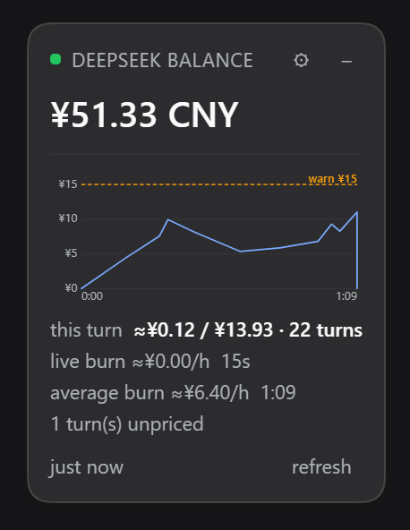
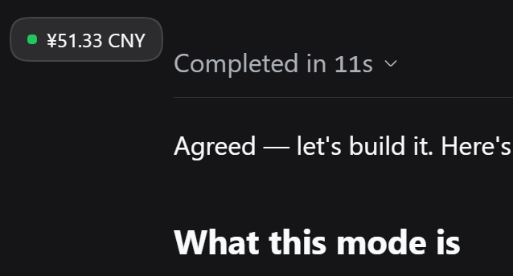

# dsh-budget-watcher

[English](README.md) | **简体中文**

这是给 [DeepSeek Harness](https://github.com/deepseek-ai/deepseek-harness)（简称 `dsh`）写的一个插件。
它会在对话窗口的上面浮一个小面板和一个实时更新的图表，让你随时直观地看到：**API 账户里还剩多少钱**，**刚才跑的这几轮对话到底花了多少**，以及**执行任务花钱的速率有多快**。



*真实账户上展开后的样子：余额、本轮和整个会话的花费、两个烧值，以及按本轮实际耗时画出来的实时烧曲线。截图对应版本 `0.6.2`。*



*点一下，或者双击标题栏，面板就会缩成胶囊，只留下状态点和金额。状态点的颜色会保留，所以缩起来之后依然能看出有没有在超支。*

面板的标题已经写着 *DeepSeek balance*，所以金额下面不再加说明文字，也没有第二行余额。数字取自 DeepSeek 公开余额接口里的
`total_balance`，也就是**充值金额加上赠送额度**，这才是真正决定下一次调用能不能成功的那一个数。这两部分**不分开显示**：
只报一个总数才是诚实的做法。如果只看 `topped_up_balance`，一个靠赠送额度正常运行的账户会显示成 `0.00`，
等于把一个好端端的账户说成没钱了。

## 面板上都是什么

下面这张表里的每个数字都直接来自上面的截图，是真实读数，不是编出来的示例。

| 显示内容 | 含义 |
| --- | --- |
| `¥51.33 CNY` | `total_balance`，也就是全部余额：充值金额**加上**赠送额度。这是面板的主数字，也是唯一的余额行。 |
| 绿色圆点 | `is_available: true`，账户可以正常调用 API。 |
| 琥珀色圆点 | 余额数据已经过期、上一次检查失败、`is_available` 为 `false`，或者实时烧超过了警告阈值。 |
| **红色圆点** | 触发了你设置的消费上限，插件**已经中断了那一轮任务**。只有这一种情况会显示红点。 |
| 红色圆点（另一种） | 什么都读不到，而且屏幕上也没有上一次的值可以顶替。 |
| `just now` | 宿主最后一次拿到应答的时间。过期的数字一定会标出来，不会当作当前值糊弄过去。 |
| `this turn ≈¥0.12 / ¥13.93 · 22 turns` | 斜杠前面是**你正在等的这一轮**花了多少，斜杠后面是**整个会话**花了多少，两边都包含它们派生出来的子代理。放在同一行，是因为「这次花了多少」和「一共花了多少」本来就是一件事。 |
| `live burn ≈¥0.00/h · 15s` | 最近 15 秒花掉的钱，折算成每小时的速率。这是用来发现突发消费的指标，两个阈值也都是拿它来判断的。这里显示 `¥0.00/h`，是因为那 15 秒里没有任何一步结算完成。**这是真实的读数，不是坏了。** 任务还在跑的时候，旁边会有一个跳动的小圆点。 |
| `average burn ≈¥6.40/h · 1:09` | 本轮的花费除以本轮的耗时，也就是 ¥0.12 摊在 1 分 09 秒上。它是一个滚动平均，等到这一轮结束就定格不再变化。 |
| 图表 | 把 `live burn` 画在本轮自己的时间轴上，横轴是 `0:00 → 1:09`。蓝线锚定在原点，因为那个时候还没花过钱；琥珀色的 `warn ¥15` 是警告阈值。 |
| `1 turn(s) unpriced` | 遇到了价目表里没有的模型，所以这些轮次只上报数量，不去猜金额。 |
| `session ¥15.12 · 4 turns` | 会话总计单独占一行，只在还没有任何轮次可以跟它配对的时候出现。 |
| `Not available for API calls` | `is_available` 为 `false`。 |
| `No API key is configured…` | 宿主没找到密钥，提示里会告诉你该设置哪个凭证引用名。 |

## 「烧」是什么

插件里有两个表示速度的概念，中文都叫「烧」，英文都叫 **burn**，指的都是**成本燃烧率**，
也就是**单位时间里花掉多少钱**，而不是一共花了多少钱。下面就不再重复解释了，一律简称「烧」。

假设你交给它一个研究任务，它把活分给了六十个子代理。这件事在对话窗口里完全看不出来：只有一轮对话开着，
一个字都还没回，余额却在不停地往下掉。光看余额，你只知道**正在花钱**，不知道**花得有多快**。
而后者才是你决定要不要停下来的依据。

面板用四个数字来回答这个问题，它们全都来自已经躺在磁盘上的数据：

- **`this turn`**：你正在等的这一轮已经花了多少。它随着每一步结算完成而增长，因为用量是按每条助手消息上报的，不是按整轮上报的。
- **`real-time burn`（实时烧）**：最近一个窗口（`burnWindowMs`，默认 **15 秒**）里花掉的钱，折算成每小时。
  这是**发现突发消费的那个数**，两个阈值也都是对它生效。它故意取较短的时间窗口，因此读数会上下浮动：
  只要这 15 秒里没有新的结算，它就会显示 0。这是如实反映，不是故障。代价是读数不够平稳，
  换来的是几秒钟之内就能发现问题，而不是等上几分钟。
- **`average burn`（平均烧）**：本轮花费除以本轮耗时。它每秒跟着真实时钟重算一次，并在这一轮结束时**定格**。
  正因为会定格，两个已经结束的任务才可以互相比较：一轮的烧是这个任务本身的属性，而不是这个账户最近的心情。
- **`session`**：这个会话里的每一轮，**再加上它底下所有子代理会话**。铺开的那种任务，钱基本都烧在子代理身上，
  如果只统计你眼前这个会话，看到的将是一片平静，而真正在花钱的地方根本没被算进去。后面的 `N agents` 告诉你有多少个还在跑。

之所以要分成两个烧，而不是只给一个数，是因为一个数会把两件事同时盖住：如果把 15 秒的窗口平均进整轮的平均值，
得到的数既不够及时，抓不住正在失控的花销，也不够稳定，没法拿来比较不同任务。

既然整件事的重点是**认出贵的那一轮**，那么 **`this turn` 和两个烧都把该轮派生出来的代理算在里面**，
而且归因方式是**按时间窗口**，不是按轮次编号。子代理有自己独立的一套轮次编号，
如果只把对话本身的轮次加起来，那么六十个代理一起烧钱的时候，你会看到一个相当平静的数字。

设置页会把最近的轮次按**烧从高到低**排出来，同时给出花费、烧率和耗时。这样一来，贵任务在事后也认得出来，
而不是只在它正跑着的时候才看得出来。

### 两个阈值，以及会掐断任务的那一个

两个阈值都用**余额本身的币种**来表示：人民币账户就是元/小时，美元账户就是美元/小时。

- **`burnWarnPerHour`** 会让状态点变成琥珀色，并给实时烧上色。它只是提示，不做任何动作。
- **`terminateAbovePerHour`** 则更进一步：当实时烧越过它时，插件会**中断正在跑的这一轮**，
  效果和你按下停止按钮完全一样，同时状态点变红。它**默认是关闭的（`0`）**。中断任务是有破坏性的操作，
  而它依据的又是一个估算值，所以必须由你主动打开。

真的触发时，有几件事值得一提：中断按轮次编号**上锁**，所以一个失控的轮次只会被中断一次，而不是每次轮询都中断一次；
你已经排在队列里的输入会被保留下来；会话日志里会记下
`turn/end` 以及 `reason: { kind: "aborted", reason: { kind: "hook", reason: "dsh-budget-watcher/over-budget" } }`，
这样这一轮的结束就有了明确的原因，而不像是一次崩溃。

## 图表怎么读

图表在数字的下面、刷新行的上面，把这一轮的实时烧画在它自己的耗时轴上，也就是这一轮对话的 `d(币种)/dt`。
它默认开启，可以用 `graphEnabled` 关掉。

它占满面板内容区的宽度，因此和 `this turn` 那一行左右对齐；同时它不会把面板撑得比文字更宽，面板能保持窄正是靠这一点。

- **横轴是这一轮本身，而不是一个滑动窗口。** 任务运行时它每秒增长，轮次一结束就停住。这样画出来的是一个任务从开始到结束的全过程，
  而不是一个会忘事的滑动窗口。定格住的图表，就是一轮已完成任务的完整历史。
- **纵轴只会往上升**，而且只在出现新的最高值时才重新缩放。它在任务进行中绝不会缩小到曲线下面去，
  否则一个正在下降的烧会看起来像悬崖。网格线落在 1、2、5 乘以 10 的幂上，峰值会写进图表的无障碍描述里。
- **蓝色**是实时烧，**琥珀色**是 `burnWarnPerHour`，**红色**是 `terminateAbovePerHour`。
  最后这条线只有在该值大于 `0` 时才会画出来，因为在关闭状态下画一条停止线，等于在宣称一件不可能发生的事。
  每条线旁边的说明文字用的是这条线自己的颜色，所以浅色和深色主题下都看得清。
- **纵轴上每个刻度的小数位数是一致的**，由步长决定。所以轴上读出来是 `¥0 / ¥20 / ¥40`，
  而不是 `¥10` 压在 `¥5.00` 上面。
- **曲线锚定在坐标原点。** `t=0` 时还没花过钱，那里的烧如实就是零。如果从第一个结算点开始画，
  图的左半边看起来会像是缺了一段数据。
- **高于量程的阈值会钉在顶边**，并标一个 `▲`，而不是干脆不画。与其把你设置的这条线藏起来，不如让它超出量程显示出来。
- 这条线和 `live burn` 那一行是同一个窗口值，所以两者不可能互相矛盾。宿主在每个结算点采一个样，面板每秒把曲线延伸到「现在」。

## 数字是怎么算出来的

DeepSeek 会在每条助手消息上上报精确的 token 用量，DSH 会把它写进会话日志。插件读这份日志，再乘以 DeepSeek 公布的价目：

```
成本 = 未命中缓存的输入 × 缓存未命中单价
     + 命中缓存的 token × 缓存命中单价
     + 输出 token        × 输出单价
```

有两个细节决定了这份计算是「估算」还是「算错」：

- **DSH 里的 `inputTokens` 是*未命中缓存*的那一半。** 缓存相关的桶是单独的。如果把缓存读取量从 `inputTokens` 里减掉
  （看起来挺自然的算法），那么在缓存命中良好的轮次里，未命中这一半会直接归零，结果是恰好少报了最该盯住的那几轮。
  `dsh-llm-deepseek` 把这个恒等式写得很清楚：
  `totalTokens = inputTokens + outputTokens + cacheReadTokens + cacheWriteTokens`。
- **重试也是要计费的。** 一次失败的尝试会以 `assistant/attempt` 的形式落地，而这个事件**没有** `usage` 字段，
  数字只存在于它数据流里最后一个 `usage` chunk 中。如果只读 `usage`，每一次重试的成本都会被悄悄漏掉。

### 这里没有汇率

DeepSeek 的价目表**同时**公布人民币价和美元价，所以插件两张表都带着，按你选的币种来计价；选 `auto` 时，
就跟着当前展示的那个钱包的币种走。整个插件**不涉及任何汇率**。这也意味着两种币种的数字**不是彼此的换算结果**：
flash 在空闲时段的输出价是 $0.60，或者 ¥4（隐含汇率大约是 6.67），而真实汇率更接近 7.2。
插件只支持这两种币种，其他币种会回落到美元表。

高峰和空闲的单价按每次调用自己的时间戳来判定（高峰是 UTC 01:00–04:00 和 06:00–10:00，周一到周五，
对应北京时间 09:00–12:00 和 14:00–18:00）。`reasoningTokens` 会被记录下来，但绝不单独计价，
因为它是输出 token 的一个子集，重复计价只会把成本算高。

## 安装

```bash
# 从本地目录安装（开发时用）
dsh plugin --profile <你的 profile> add link:/path/to/dsh-budget-watcher

# 从 GitHub 安装
dsh plugin --profile <你的 profile> add github:NeutronStar714/dsh-budget-watcher
```

装好之后重启对应的 profile。**DSH 桌面应用自带的 profile 不能从命令行安装**，它由 Electron 应用独占管理，
请改用**设置 → 插件**页面。

### 卸载

```bash
dsh plugin --profile <你的 profile> remove dsh-budget-watcher
```

只想临时停用、不想卸载的话：

```yaml
- id: budget-watcher
  disabled: true
```

## API 密钥

插件需要一个能读余额的 DeepSeek API 密钥。默认从凭证引用 `DEEPSEEK_API_KEY` 读取，也可以直接在配置里写 `apiKey`。
密钥只在宿主进程内部使用，**永远不会发到网页上**：设置表单只知道「有没有设置过」，不知道具体内容。

## 配置

| 选项 | 默认值 | 说明 |
| --- | --- | --- |
| `provider` | `deepseek` | 读哪个 API 账户。目前只实现了 `deepseek`。 |
| `apiKey` | *(空)* | 直接写死的密钥。留空时改用下面的凭证引用。 |
| `apiKeyEnv` | `DEEPSEEK_API_KEY` | 存放密钥的凭证引用名。 |
| `endpoint` | *(由 provider 决定)* | 覆盖余额接口地址，用来对着测试服务器联调。 |
| `refreshIntervalMs` | `60000` | **宿主**复用同一个余额应答多久之后，才再次请求 DeepSeek。最小 `15000`。它管的是**上游调用**，不是面板的轮询频率。 |
| `requestTimeoutMs` | `10000` | 单次余额请求的超时时间。 |
| `currency` | `auto` | 成本数字和两个阈值用哪种币种显示。`auto` 跟随当前展示的余额钱包，也可以强制指定 `CNY` 或 `USD`。取值是固定的几个，因为 DeepSeek 只公布这两种币种的价格。 |
| `allowNonLoopback` | `false` | 允许在非回环地址上提供这个接口。默认关闭。 |
| `costEnabled` | `true` | 根据 provider 已经上报的用量，估算每一轮的成本。它本身**不消耗任何 token**。 |
| `graphEnabled` | `true` | 在面板里绘制实时烧图表。关掉之后所有数字都还在。 |
| `burnWindowMs` | `15000` | **实时烧**的窗口长度，单位毫秒，最小 `5000`。故意取得比较短，因为它才是抓突发消费的那一个数。 |
| `burnWarnPerHour` | `2` | 每小时花费超过它就变琥珀色。单位是余额本身的币种。填 `0` 表示关掉警告。 |
| `terminateAbovePerHour` | `0` | 每小时花费超过它就**中断当前轮次**。单位同样是余额本身的币种。`0`（也就是默认值）表示关掉。 |

**没有汇率选项，因为根本用不上汇率。** 成本直接取自 DeepSeek 公布的**人民币或美元价目表**，
跟当前显示的余额币种保持一致。

## 设置面板

点面板上的**齿轮按钮**，DSH 右侧栏会打开一个 *Budget* 标签页，上面每个选项都是一个可以编辑的输入框，底部有保存按钮。
齿轮只在确实能注册出标签页的时候才出现，所以它永远不会变成一个点了没反应的控件。

时间长度都按你习惯的单位显示（余额缓存和实时烧窗口都是**秒**），保存时再换算回去。API 密钥字段是只写的：
初始是空的，留空表示*别动它*；把它清空，则会从配置里删掉这个密钥。运行中的密钥值从来不会发到网页上。

`Currency` 是一个只有 `auto` / `CNY` / `USD` 三个选项的**下拉框**，不是自由输入的文本框：
这三个正是 DeepSeek 会公布价格的币种，填别的只会是错的。两个阈值旁边的单位会写出余额实际使用的币种。

表单本身**可以滚动**，保存按钮固定在底部，所以不管设置项和最近轮次列表有多长，保存按钮都不会够不到。
轮次列表另外设了高度上限，自己独立滚动。

保存走的是 DSH 自己的配置编辑器，所以改动会写进你 profile 的 `cordis.patch.yml`，并由正常的加载流程生效——
和你手工编辑时是同一个文件、同一套机制：

```yaml
- id: budget-watcher
  name: dsh-budget-watcher
  config:
    currency: CNY
    burnWindowMs: 15000
    burnWarnPerHour: 3.5
    terminateAbovePerHour: 0
```

把某一项改回默认值，这一项会被删除而不是写进去，于是它重新回到「继承默认」。改配置**不需要重启 DSH**。

## 已知限制

完整的 55 条限制写在英文 [README](README.md#known-limitations) 里，**以那一份为准**。下面按主题重新编排过，
和英文版逐条对应，只是措辞更紧凑一些；如果两边有出入，请以英文版为准。

### 余额

1. **数据来自公开的余额接口。** 它不是 DeepSeek 官方支持的 API，随时可能变更甚至消失。接口变了，插件会报错，而不是瞎猜。
2. **接口返回的 `total_balance` 会原样显示，不做重算**，所以你看到的就是接口返回的值。
3. **没有 `is_available`，也拿不到赠送额度的有效期。** 赠送额度什么时候过期、以后计费方式怎么变，都在插件的视野之外。
4. **余额本身是粗略的。** 接口只给两位小数，而且可能存在结算延迟。
5. **余额接口返回的是 API 密钥对应账户的余额**，不是网页登录的开放平台账户余额。
6. **是轮询，不是推送。** 这里没有 SSE 流，所以面板只能靠轮询。而且这里有**两个刻意分开的间隔**：
   面板每隔几秒轮询一次它自己的本地宿主接口（任务运行时 2 秒，空闲时 3 秒），这样才能及时发现新的提示词；
   而 `refreshIntervalMs`（最小 15 秒，默认 60 秒）决定的是**宿主**复用同一个余额应答多久之后才再次调用 DeepSeek。
   把这两个混为一谈正是 `0.6.3` 修掉的 bug：面板继承了 60 秒的轮询周期，看起来就像卡住了，直到有人去按刷新。
7. **除了同源围栏之外，这个接口没有鉴权。** 它不在 DSH 需要鉴权的 `/api` 前缀下面，所以插件自己做回环地址和同源检查。
   它只返回余额数字，从不返回凭证。如果你的部署绑定了非回环地址，那么在那个网络上任何人都能访问这个接口，
   除非你保持 `allowNonLoopback` 关闭。
8. **围栏相信自己看到的 Host 头。** 这一点只有在绑定回环地址时才成立。
9. **网页上能看到余额，但这个页面本身并不安全。** 任何能打开这个界面的人都能看到账户余额。
10. **只实现了 DeepSeek。** 其他 provider 都还没做。

### 客户端界面

11. **浮层是直接操作 DOM 来定位的**，没有走 DSH 的布局系统。拖拽后的位置存在 `localStorage` 里，清理浏览器数据就会重置。
12. **折叠成胶囊之后刻意不能拖动**，免得它被不小心碰走。
13. **没有做界面本地化。** 面板上的文案是硬编码的英文。本文件只是文档翻译，不是界面翻译。
14. **宿主模块在一个进程里只会被导入一次。** 所以改了已经加载的插件源码，必须重启 DSH 才会生效；
    而客户端那一半每次请求都从磁盘重新读取，于是它会很乐意地给一个过期的宿主画出界面。
    每个 payload 里都带 `pluginVersion`，就是为了让这种情况能被一眼看出来。
15. **DSH 桌面应用自带的 profile 不能从命令行安装**，它由 Electron 应用独占管理。

### 成本估算

16. **价目表是一份快照，不是订阅。** 价格写在 `lib/cost.js` 里，同时记录了读取日期（`PRICING_READ_ON`），这个日期也会出现在 payload 里。
    DeepSeek 改价不会被自动发现，面板会继续很自信地报着旧价格。
17. **没有考虑中国的法定节假日。** 高峰和空闲是按 UTC 时间窗口算出来的，但节假日的排除没有做——
    官方文档没公布这份日历，而且每年都变。`PRICING_READ_ON` 之后的第一个节假日，工作日会被按高峰计价，
    也就是**把成本算高了**。对花钱告警来说，这是偏安全的方向。
18. **价目表是两张各自公布的表，不是互相换算出来的。** 插件两张都带着，按你选的币种计价；选 `auto` 时跟随当前展示的余额钱包。
    两种币种的数字不是彼此的换算结果，而且只支持这两种，其他会回落到美元表。
19. **只统计当前还活着的 agent 树。** 花费归属于轮询时仍然活着的会话，加上本进程已经记住的会话。
    如果一个铺开的任务在插件加载**之前**就已经结束，它不在活跃列表里，那部分子代理花费不会被算进会话总计；
    根会话自己的轮次仍然会计入。
20. **记住的总计可能比活跃的总计更大。** 这是刻意的：已经结束的子代理会继续贡献，这样数字永远不会往回掉。
21. **`ownEvents()` 和 `snapshotEvents()` 在 DSH 里已经废弃。** 它们是插件唯一能读到整份日志的途径，
    而 DSH 自己的说明里禁止新的生产环境调用。每次调用都包了 try/catch：万一以后版本把它们移除了，
    成本部分会消失，但余额仍然照常工作。
22. **没有价格模型的轮次只上报数量，不估算金额**，显示为 `N turn(s) unpriced`。静默地显示成零，会被读成「那一轮免费」。
23. **重试用的模型是推断出来的。** `assistant/attempt` 事件不带模型名，所以按该轮的模型来计价，再回落到会话自己的请求上下文。
    如果某一轮在重试途中换了模型，这次重试就会按错误的价格计算。
24. **推理 token 不单独计价。** DSH 确实会填 `reasoningTokens`，但它是输出 token 的子集，重复计价只会高估。
25. **按 token 计价，而 token 的切分是模型自己的事。** 这是目前唯一可用的粒度。
26. **多模态输入只按文本计价**，图片之类的计价方式不在统计范围内。

### 宿主插件与加载

27. **本插件是普通的 Cordis 插件**，不依赖任何私有 API。
28. **配置校验依赖 `@deepseek-ai/schemastery` 能被解析到。** 它被声明为 peer dependency，
    因为 DSH 的 profile 解析会拦截 peer 名；缺了它，`Config` 会静默变成 `undefined`，配置就永远不会被校验。
29. **不要添加 `@deepseek-ai/dsh*` 作为 peer。** 兼容性闸门会检查这些版本范围，一旦不满足，整行都会被静默跳过。
30. **刻意没有使用 `.volatile()`。** 它确实能让改动不重载 fiber，但字段会变成必须在每次读取时解引用的 getter 对象；
    普通字段加一次 fiber 重载更简单，而且确实验证过能生效。

### 轮次成本与「烧」

31. **烧是累计平均，不是瞬时速率。** 成本是随着每个结算步成块到达的，瞬时速率会在每一步冒出一个尖峰、在步与步之间读作零。
32. **正在跑的轮次，烧在步与步之间会往下衰减。** 分子只在结算时变化，分母每秒都在变。
33. **实时数字是在浏览器里算的。** 宿主发来花费和轮次起点，面板本地按 1 Hz 走时重算，这样显示是活的，又不需要每秒发一个请求。
34. **一轮的数字包含它的子代理，按时间窗口归因。** 这是刻意的，但也意味着：如果某个更早轮次的长命子代理，
    它的调用落在了本轮的窗口里，就会被算进来。反过来，轮次结束**之后**还在继续的工作不会算，
    所以定格的数字可能低估一个活得比根轮次更久的铺开任务。
35. **实时烧会来回跳。** 15 秒窗口在这段时间内没有任何结算时就会读作 `0`，只要某一步的响应慢过 15 秒就会这样。
    这是真实读数，不是 bug，也正是需要 `average burn` 作为稳定对照的原因。
36. **轮次历史有上限，而且只覆盖根会话。** 对比表保留最近 10 个已结束的轮次，不做持久化，重启就是空的，也没法跨会话比较。
37. **走时用的是宿主的时钟。** payload 里带着宿主的 `serverNow`，页面据此校正偏移，所以浏览器时钟漂移不会扭曲轮次时长。
    它假设两者在同一台机器上，对本插件提供的回环接口来说这个假设成立。

### 中断轮次

38. **轮次定位是建议性的，不是原子的。** 这里是最重要的一条。`Agent` 比任何一轮都活得久，
    所以手里拿着一个引用，标识的是 *agent* 而不是某一轮；在读取实时烧和调用 `cancel` 之间，
    确实存在一个窗口，轮次可能已经结束、后继的一轮已经开始，而 API 里没有任何东西可以「取消第 N 轮」。
    插件在调用前后各采样一次开放的轮次边界，这挡不住误伤，但能把一次静默的误伤变成日志里的一条 `raced-next-turn`。
    如果它在你没预料到的时候触发了，就去日志里找这一行。
39. **默认关闭，而且在看清真实烧率之前，最好让它保持关闭。** `terminateAbovePerHour` 默认是 `0`。
    中断任务具有破坏性，而它判断依据的是从 15 秒窗口算出来的估算值，阈值设低了就会打断正常工作。
    建议先把 `burnWarnPerHour` 设好，观察你的轮次实际烧多少，再把上限设在它上面。
40. **检查发生在读接口里。** 是否中断是在余额 `GET` 请求里决定的，这是读操作带副作用，并不优雅。
    烧只在那一个地方计算，替代方案是再开一个定时器，把同一份账重算一遍。默认关闭，是让这个折中能被接受的原因。
41. **退出的方式是协作式的。** `cancel` 会中止在途的请求，并排空或跳过工具调用；但已经在执行的工具是被排空，而不是被强行杀掉，
    而且 provider 的 socket 是否立刻断开，还要看具体的适配器。所以一轮任务有可能在真正停下来之前，先把当前这个工具调用跑完。
42. **子代理不保证会被停掉。** 前台进程内的子代理会继承父级的 abort 信号，确实会停；后台的和可继续的子代理则不一定。
    插件只中断根轮次，不遍历整棵树，所以一个铺开任务的后台代理可能比被中断的那一轮活得更久。
43. **每一轮只停一次，而且不会重新上锁。** 触发是按轮次编号锁存的，所以一个轮次最多只会被中断一次。
    之后的轮次可以正常被停；但如果**同一个**轮次在被取消之后仍然继续跑，它就不会被停第二次了。

### 设置面板与图表

44. **设置表单自己负责滚动。** 侧边栏给标签页的是一个有界高度，而且不会替它滚动；所以表单本身就是滚动容器，保存按钮钉在它底部；
    最近轮次列表另外限高，自己独立滚动。没有这套安排，折叠线以下的内容——包括保存按钮——根本够不到，
    而这正是它修掉的那个 bug。
45. **图表需要有轮次才会画。** 会话里还没有任何轮次时，就没有时间轴可画，于是图表不出现，而不是显示一张空图。
    它也不做持久化：序列每次轮询都从会话日志重建，所以能挺过面板重载和 DSH 重启，但它本身不存储在任何地方。
46. **曲线是窗口速率，所以既会升也会降。** 它和 `live burn` 那一行是同一个 15 秒的数字，
    因此一段长于窗口的安静期会把曲线拉回零附近。这是速率在如实反映情况，不是图表出故障。
47. **纵轴锁在最高水位上。** 它只在出现新的最大值时才变化，所以回落的速率不会把刻度一起拉下来——
    曲线在固定的画框里往下走，而不是整张图跟着你重新缩放。代价是：早期的一个尖峰把上限顶高之后，
    长轮次后段的细节看起来会比较平。
48. **超出量程的阈值是钉住显示的，而不是省略掉。** 它贴在顶边、画成虚线，并标一个 `▲`。
    钉住的线读不出具体数值，真实数字写在标签里。
49. **序列是抽稀，不是截断。** 铺开的任务可能结算好几百步，超过 240 个采样之后，宿主会把它们均匀抽稀，
    这样保留下来的是整轮的形状，而不是只有前半段。
50. **网格线是整数，不是数据的等分。** 步长取 1、2、5 乘以 10 的幂，任何量级下都还算好读，
    但也意味着最上面那条线通常高于峰值，而不是正好落在峰值上。
51. **图表的高度是比例，面板的宽度由文字决定。** 图表是内容框的固定比例（240:100），所以它跟着最宽的那一行文字走。
    因此面板很窄的时候，坐标标签也会跟着一起缩小——图表宽度低于大约 100 个 CSS 像素时就不太好读了，
    这时候诚实的做法是把图表关掉。
52. **面板宽度由最长的那一行文字决定**，实际中就是 `this turn ≈¥0.78 / ¥13.05 · 19 turns`。
    面板里没有别的东西能把它撑宽：图表被刻意阻止贡献自己的固有宽度，余额和标题都比它短。那行变长，面板就跟着变宽。

### 货币

53. **余额那一行没法跟随 `currency` 设置。** 成本是算出来的，所以可以用你选的币种表达；余额不是算出来的——
    它是接口按账户自己的币种返回的一个数字——因此只能以账户实际持有的币种显示。
    在一个只有人民币钱包的账户上强制选 `USD`，结果就是人民币余额配美元成本，设置页会在阈值下面明说这一点。
    要把余额换算成美元，就得有汇率，而这个插件按设计没有汇率来源。
54. **所有成本数字会一起变化。** 15 秒实时烧、轮次平均、会话总计，以及最近轮次表里的每一行，
    在币种改变时都会按 token 数重新计价，所以对比表内部始终保持可比。
    如果把过去轮次用一种币种、当前轮次用另一种币种混在一张表里，这张表唯一的作用——比较任务——就没了。

### 文档

55. **本文件是 `README.md` 的翻译，不是独立的权威来源。** 英文版会先更新，两者出现差异时以英文版为准。

## 开发

没有构建步骤，也没有运行时依赖。`node --test` 就是全部工具链。

```bash
node --test
```

`test/` 下的用例覆盖了：余额归一化、成本模型和**两张价目表**、会话账本（铺开、子代理、结束不减少、会话隔离、轮次烧、定格时长、
窗口化的烧序列）、宿主接口（缓存、单飞、`?refresh=1`、围栏、配置写入、中断只触发一次、以及各种失败模式），
以及客户端 bundle（注册形态、插槽挂载、拖拽范围、会话握手、实时与平均烧、设置表单的滚动与固定保存、
图表的折线／阈值／开关／为 `0` 时不画停止线、说明文字的配色、坐标精度统一、原点锚定、阻止图表撑宽面板、
本轮与会话合并成一行、轮询间隔是秒而不是 60 秒的缓存窗口）。

## 许可

[MIT](LICENSE)
